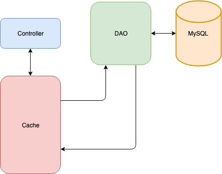

# Spring Data Caching Tutorial

This tutorial steps you through creating a basic CRUD REST web service and configuring it to use Spring Boot caching.

You will need:

* MySQL Server
* MySQL Workbench
* Spring Initializr (start.spring.io)
* IntelliJ IDEA Community Edition

## System Design

The system we'll build is a simple REST web service that keeps track of RSVPs to an event.

### Model

The application keeps track of three items for each RSVP:

* A unique ID
* The guest name
* The total number of people attending

### Database

The database consists of a single table:

```sql
create schema if not exists rsvp;
use rsvp;

create table if not exists rsvp (
	rsvp_id int not null auto_increment primary key,
    guest_name varchar(50) not null,
    total_attending int not null
);
```

### REST API

The REST API for this application consists of five endpoints:

```
Create RSVP
===========
URL: /rsvps
HTTP Method: POST
RequestBody: RSVP data
ResponseBody: RSVP data + ID

Get RSVP
========
URL: /rsvps/{id}
HTTP Method: GET
RequestBody: None
ResponseBody: RSVP data

Get All RSVPs
=============
URL: /rsvps
HTTP Method: GET
RequestBody: None
ResponseBody: Array of RSVP data

Update RSVP
===========
URL: /rsvps/{id}
HTTP Method: PUT
RequestBody: RSVP data
ResponseBody: None

Delete RSVP
===========
URL: /rsvps/{id}
HTTP Method: DELETE
RequestBody: None
ResponseBody: None
```

### Cache

The RSVP application is a typical REST CRUD web service with the addition of a caching layer to reduce the number of database calls the application has to make:




## Building the System

We will build the system in the following steps:

1. Create the database.
2. Create the project.
3. Create the model.
4. Create DAO interface.
5. Implement tests for DAO.
6. Implement DAO.
7. Implement REST API.
8. Configure caching.

### Step 1: Create the Database

Open MySql Workbench and run the following SQL scripts, which will create the ```rsvp``` and ```rsvp_test``` databases.

```sql
create schema if not exists rsvp;
use rsvp;

create table if not exists rsvp (
	rsvp_id int not null auto_increment primary key,
    guest_name varchar(50) not null,
    total_attending int not null
);
```

```sql
create schema if not exists rsvp_test;
use rsvp_test;

create table if not exists rsvp (
	rsvp_id int not null auto_increment primary key,
    guest_name varchar(50) not null,
    total_attending int not null
);
```


### Step 2: Create the Project

The next step is to create the application.  We'll use the Spring Initializr to create our project. Go to ```start.spring.io``` and enter the following information:

- Group = com.trilogyed
- Artifact = rsvp-service
- Dependencies = Spring Web Starter, JDBC API, MySQL Driver, Spring cache abstraction

Download the project, copy it into your working directory, and open the project in IntelliJ.

##### Add JUnit 4 Dependency to the pom.xml file
 * Add the following dependency to the pom.xml file:

```java
<dependency>
    <groupId>junit</groupId>
    <artifactId>junit</artifactId>
    <version>4.13</version>
    <scope>test</scope>
</dependency>   
```

##### API Main Database Configuration (15 min)

The purpose of this section is to show you how to configure the connection to MySQL using the application.properties file.

The database connection configuration for the application is contained in the `src --> main --> resources --> application.properties` file.

- Open this file and add the following entries:

```java
spring.datasource.url: jdbc:mysql://localhost:3306/rsvp?useSSL=false&serverTimezone=UTC&allowPublicKeyRetrieval=true
spring.datasource.username: root
spring.datasource.password: rootroot
```

###### Note about serverTimeZone configuration 
###### - If the “serverTimezone=UTC” does not work on your machine then it may be necessary to change UTC to a more specific timezone setting based on your location. For example,  “serverTimezone=US/Central” is valid syntax for Central Time. Lastly, omitting the time zone from the datasource url altogether should also be considered when troubleshooting. One of these three options should work.

##### Test Database Configuration (15 min)
The database connection configuration for the tests is contained in the `src --> test --> resources --> application.properties` file:

- Add the resources directory in the src/test folder.
- Create a new application.properties file in this folder.
- Add the following entries to this file. Note that the schema name for this one is rsvp_test:

```java
spring.datasource.url: jdbc:mysql://localhost:3306/rsvp_test?useSSL=false&serverTimezone=UTC&allowPublicKeyRetrieval=true
spring.datasource.username: root
spring.datasource.password: rootroot
```
###### Note about serverTimeZone configuration 
###### - If the “serverTimezone=UTC” does not work on your machine then it may be necessary to change UTC to a more specific timezone setting based on your location. For example,  “serverTimezone=US/Central” is valid syntax for Central Time. Lastly, omitting the time zone from the datasource url altogether should also be considered when troubleshooting. One of these three options should work.


#### 2.1: Rename the ```rsvpservice``` Package

Before we begin implementation, rename ```com.trilogyed.rsvpservice``` to ```com.trilogyed.rsvp```. This is not strictly necessary but is done for convenience.


### Step 3: Create the Model

Now we will create the model object for our application. This Java class represents the RSVP information and matches the fields in the database. 

Create a new file called ```com.trilogyed.rsvp.model.Rsvp.java``` and add the following code:

```java
public class Rsvp implements Serializable {
    private int id;
    private String guestName;
    private int totalAttending;

    public Rsvp() {

    }

    public Rsvp(String guestName, int totalAttending) {
        this.guestName = guestName;
        this.totalAttending = totalAttending;
    }

    public int getId() {
        return id;
    }

    public void setId(int id) {
        this.id = id;
    }

    public String getGuestName() {
        return guestName;
    }

    public void setGuestName(String guestName) {
        this.guestName = guestName;
    }

    public int getTotalAttending() {
        return totalAttending;
    }

    public void setTotalAttending(int totalAttending) {
        this.totalAttending = totalAttending;
    }

    @Override
    public boolean equals(Object o) {
        if (this == o) return true;
        if (o == null || getClass() != o.getClass()) return false;
        Rsvp rsvp = (Rsvp) o;
        return id == rsvp.id &&
                totalAttending == rsvp.totalAttending &&
                Objects.equals(guestName, rsvp.guestName);
    }

    @Override
    public int hashCode() {
        return Objects.hash(id, guestName, totalAttending);
    }

    @Override
    public String toString() {
        return "Rsvp{" +
                "id=" + id +
                ", guestName='" + guestName + '\'' +
                ", totalAttending=" + totalAttending +
                '}';
    }
}
```

Items to note about this code:

* This class must implement the Serializable interface so the caching framework can cache ```Rsvp``` objects. Serializable is a **marker** interface that indicates that an implementing class can be serialized and deserialized. Marker interfaces have no properties or defined methods.

### Step 4: Create the DAO Interface

The next step is to create the DAO interface and an empty implementation. 

#### 4.1: Create the DAO Interface

Create a new Interface called ```com.trilogyed.rsvp.dao.RsvpDao.java``` and add the following code:

```java
public interface RsvpDao {

    public Rsvp addRsvp(Rsvp rsvp);

    public Rsvp getRsvp(int id);

    public List<Rsvp> getAllRsvps();

    public void updateRsvp(Rsvp rsvp);

    public void deleteRsvp(int id);
}
```

#### 4.2: Create an Empty Implementation

Create a new class called ```com.trilogyed.rsvp.dao.RsvpDaoJdbcTemplateImpl.java```. Have this class implement the Rsvp interface and have IntelliJ supply default implementations for all of the methods. 

Your class should look like this:

```java
public class RsvpDaoJdbcTemplateImpl implements RsvpDao {
    @Override
    public Rsvp addRsvp(Rsvp rsvp) {
        return null;
    }

    @Override
    public Rsvp getRsvp(int id) {
      return null;
    }

    @Override
    public List<Rsvp> getAllRsvps() {
        return null;
    }

    @Override
    public void updateRsvp(Rsvp rsvp) {
    }

    @Override
    public void deleteRsvp(int id) {
    }
}
```


### Step 5: Implement the DAO Tests

Now we will implement the unit tests for the DAO using TDD, Red/Green/Refactor, and AAA techniques. 

Create a new Java class called ```com.trilogyed.rsvp.dao.RsvpDaoTest.java``` under ```src/test/java```. Add the following code to your test suite:

```java
@RunWith(SpringRunner.class)
@SpringBootTest
public class RsvpDaoTest {

    @Autowired
    RsvpDao dao;

    @Before
    public void setUp() throws Exception {

        List<Rsvp> rsvps = dao.getAllRsvps();

        rsvps.stream()
                .forEach(rsvp -> dao.deleteRsvp(rsvp.getId()));
    }

    @Test
    public void addGetDeleteRsvp() {
        Rsvp rsvp = new Rsvp("John Doe", 2);
        rsvp = dao.addRsvp(rsvp);
        Rsvp fromDao = dao.getRsvp(rsvp.getId());
        assertEquals(fromDao, rsvp);
        dao.deleteRsvp(rsvp.getId());
        fromDao = dao.getRsvp(rsvp.getId());
        assertNull(fromDao);
    }

    @Test
    public void getAllRsvps() {
        Rsvp rsvp = new Rsvp("Sally Smith", 4);
        dao.addRsvp(rsvp);

        rsvp = new Rsvp("George Smith", 3);
        dao.addRsvp(rsvp);

        List<Rsvp> rsvps = dao.getAllRsvps();

        assertEquals(2, rsvps.size());
    }

    @Test
    public void updateRsvp() {
        Rsvp rsvp = new Rsvp("Joe Jones", 5);
        rsvp = dao.addRsvp(rsvp);
        rsvp.setGuestName("NEW NAME");
        dao.updateRsvp(rsvp);
        Rsvp fromDao = dao.getRsvp(rsvp.getId());
        assertEquals(rsvp, fromDao);
    }
}
```

### Step 6: Implement the DAO

Next we will implement the DAO, turning the Red (failing) tests to Green (passing). This class is a straightforward JdbcTemplate implementation of our DAO interface. 

Open ```com.trilogyed.rsvp.dao.RsvpDaoJdbcTemplateImpl.java``` and add the following code:

```java
@Repository
public class RsvpDaoJdbcTemplateImpl implements RsvpDao {

    private static final String INSERT_RSVP =
            "insert into rsvp (guest_name, total_attending) values (?, ?)";
    private static final String SELECT_RSVP =
            "select * from rsvp where rsvp_id = ?";
    private static final String SELECT_ALL_RSVPS =
            "select * from rsvp";
    private static final String UPDATE_RSVP =
            "update rsvp set guest_name = ?, total_attending = ? where rsvp_id = ?";
    private static final String DELETE_RSVP =
            "delete from rsvp where rsvp_id = ?";

    @Autowired
    JdbcTemplate jdbcTemplate;

    public RsvpDaoJdbcTemplateImpl(JdbcTemplate jdbcTemplate) {
        this.jdbcTemplate = jdbcTemplate;
    }

    @Override
    @Transactional
    public Rsvp addRsvp(Rsvp rsvp) {
        jdbcTemplate.update(INSERT_RSVP,
                rsvp.getGuestName(),
                rsvp.getTotalAttending());
        int id = jdbcTemplate.queryForObject("select last_insert_id()", Integer.class);
        rsvp.setId(id);
        return rsvp;
    }

    @Override
    public Rsvp getRsvp(int id) {
        try {
            return jdbcTemplate.queryForObject(SELECT_RSVP, this::mapRowToRsvp, id);
        } catch (EmptyResultDataAccessException ex) {
            // if nothing is returned for this query, just return null
            return null;
        }
    }

    @Override
    public List<Rsvp> getAllRsvps() {
        return jdbcTemplate.query(SELECT_ALL_RSVPS, this::mapRowToRsvp);
    }

    @Override
    public void updateRsvp(Rsvp rsvp) {
        jdbcTemplate.update(UPDATE_RSVP,
                rsvp.getGuestName(),
                rsvp.getTotalAttending(),
                rsvp.getId());
    }

    @Override
    public void deleteRsvp(int id) {
        jdbcTemplate.update(DELETE_RSVP, id);
    }

    private Rsvp mapRowToRsvp(ResultSet rs, int rowNum) throws SQLException {
        Rsvp rsvp = new Rsvp();
        rsvp.setId(rs.getInt("rsvp_id"));
        rsvp.setGuestName(rs.getString("guest_name"));
        rsvp.setTotalAttending(rs.getInt("total_attending"));
        return rsvp;
    }
}
```


### Step 7: Implement REST API

With our DAO in place and tested, it is time to implement the controller connecting the REST API to the DAO. This is a basic Spring REST controller and should be familiar to you. 

Create a file called ```com.trilogyed.rsvp.controller.RsvpController.java``` and add the following code:

```java
@RestController
public class RsvpController {

    @Autowired
    RsvpDao dao;

    public RsvpController(RsvpDao dao) {
        this.dao = dao;
    }

    @RequestMapping(value = "/rsvps", method = RequestMethod.POST)
    @ResponseStatus(HttpStatus.CREATED)
    public Rsvp createRsvp(@RequestBody Rsvp rsvp) {
        System.out.println("CREATING RSVP");
        return dao.addRsvp(rsvp);
    }

    @RequestMapping(value = "/rsvps/{id}", method = RequestMethod.GET)
    @ResponseStatus(HttpStatus.OK)
    public Rsvp getRsvp(@PathVariable int id) {
        System.out.println("GETTING RSVP ID = " + id);
        return dao.getRsvp(id);
    }

    @RequestMapping(value = "/rsvps", method = RequestMethod.GET)
    @ResponseStatus(HttpStatus.OK)
    public List<Rsvp> getAllRsvps() {
        System.out.println("GETTING ALL RSVPS");
        return dao.getAllRsvps();
    }

    @RequestMapping(value = "/rsvps", method = RequestMethod.PUT)
    @ResponseStatus(HttpStatus.OK)
    public void updateRsvp(@RequestBody Rsvp rsvp) {
        System.out.println("UPDATING RSVP ID = " + rsvp.getId());
        dao.updateRsvp(rsvp);
    }

    @RequestMapping(value = "/rsvps/{id}", method = RequestMethod.DELETE)
    @ResponseStatus(HttpStatus.OK)
    public void deleteRsvp(@PathVariable int id) {
        System.out.println("DELETING RSVP ID = " + id   );
        dao.deleteRsvp(id);
    }
}
```

### Step 8: Configure Caching

The final step in our project is to configure caching. As noted in the system design diagram above, we will do this at the controller level. We will use the default implementation (which is just a ```ConcurrentHashMap```) for this tutorial. 

Because we're using the Spring cache abstraction, the choice of caching library will not require any changes to our code. We could swap out the default implementation for any of the supported cache providers, such as Redis.

#### 8.1 Annotate the Main Application Class

We enable caching by applying the ```@EnableCaching``` annotation to the main ```Application``` class of our project. Open ```com.trilogyed.rsvp.RsvpServiceApplication.java``` and add the ```@EnableCaching``` class-level annotation. 

Your code should look like this:

```java
@SpringBootApplication
@EnableCaching
public class RsvpServiceApplication {

	public static void main(String[] args) {
		SpringApplication.run(RsvpServiceApplication.class, args);
	}
}
```

#### 8.2 Annotate the Controller

The method-level annotations we will apply to the controller dictate the caching behavior of our application. We will use the following annotations:

##### @CacheConfig

This annotation allows us to specify the name of the cache our code will use.

##### @Cacheable

This annotation indicates that the result of the given method can be cached. When the annotated method is invoked, the caching framework checks to see if the method as been previously invoked with the given parameters and if there is a value in the cache. If no value is found in the cache, the method is invoked; otherwise, the cached value is returned.

##### @CacheEvict

This annotation indicates that the object with the given key should be removed from the cache when the annotated method is invoked.

##### @CachePut

NOT USED IN THIS DEMO: This annotation specifies that the annotated method should be run and the return value of the method added to the cache.
We can specify the key that should be used when adding the result to the cache. 
For example: @CachePut(key = "#result.getId()")


Open ```com.trilogyed.rsvp.controller.RsvpController.java``` and modify the code so it looks like this:

```java
@RestController
@CacheConfig(cacheNames = {"rsvps"})
public class RsvpController {

    @Autowired
    RsvpDao dao;

    public RsvpController(RsvpDao dao) {
        this.dao = dao;
    }
    
    @RequestMapping(value = "/rsvps", method = RequestMethod.POST)
    @ResponseStatus(HttpStatus.CREATED)
    public Rsvp createRsvp(@RequestBody Rsvp rsvp) {
        System.out.println("CREATING RSVP");
        return dao.addRsvp(rsvp);
    }

    @Cacheable
    @RequestMapping(value = "/rsvps/{id}", method = RequestMethod.GET)
    @ResponseStatus(HttpStatus.OK)
    public Rsvp getRsvp(@PathVariable int id) {
        System.out.println("GETTING RSVP ID = " + id);
        return dao.getRsvp(id);
    }

    @RequestMapping(value = "/rsvps", method = RequestMethod.GET)
    @ResponseStatus(HttpStatus.OK)
    public List<Rsvp> getAllRsvps() {
        System.out.println("GETTING ALL RSVPS");
        return dao.getAllRsvps();
    }

    @CacheEvict(key = "#rsvp.getId()")
    @RequestMapping(value = "/rsvps", method = RequestMethod.PUT)
    @ResponseStatus(HttpStatus.OK)
    public void updateRsvp(@RequestBody Rsvp rsvp) {
        System.out.println("UPDATING RSVP ID = " + rsvp.getId());
        dao.updateRsvp(rsvp);
    }

    @CacheEvict
    @RequestMapping(value = "/rsvps/{id}", method = RequestMethod.DELETE)
    @ResponseStatus(HttpStatus.OK)
    public void deleteRsvp(@PathVariable int id) {
        System.out.println("DELETING RSVP ID = " + id   );
        dao.deleteRsvp(id);
    }
}
```

Items to note about the code:

1. We use the class-level ```@CacheConfig``` to set the name of the cache to be used by code in this class.
2. The ```getRsvp``` method is marked as ```@Cacheable```. The caching framework will automatically use  the ```id``` as the key. This causes the caching framework to check the cache for a value associated with the given ```id```. If an entry is found in the cache, it is returned. Otherwise, the annotated method is invoked and the returned value is stored in the cache.
3. The ```getAllRsvps``` method is not annotated. This guarantees that all entries in the database are returned when this method is invoked.
4. Both the ```updateRsvp``` and ```deleteRsvp``` methods are marked with ```@CacheEvict``` because both of these operations invalidate the cache entries for their respective Rsvps.

## Run the System

Now we can demonstrate the caching behvior of the system. Start your project and open Postman.

1. Add Rsvps.

    Add several Rsvps to the system via Postman. Note the system assigned ID of each of the Rsvps. You should see a ```CREATING RSVP``` message in the console for each new Rsvp.

2. Get Rsvps.  

    Retrieve each of your newly created Rsvps via Postman. You should see a ```GETTING RSVP ID = n``` (where n = the ID of the requested Rsvp) **the first time** you request each Rsvp. You should not see this message for subsequent requests for the Rsvps.

3. Update an Rsvp.

    Update one of the Rsvps that has been cached using Postman. Now retrieve that Rsvp from the service via Postman. You should see a ```GETTING RSVP ID = n``` message in the console. Retrieve that Rsvp from the server again and you should not see the message.

---

© 2019 Trilogy Education Services
